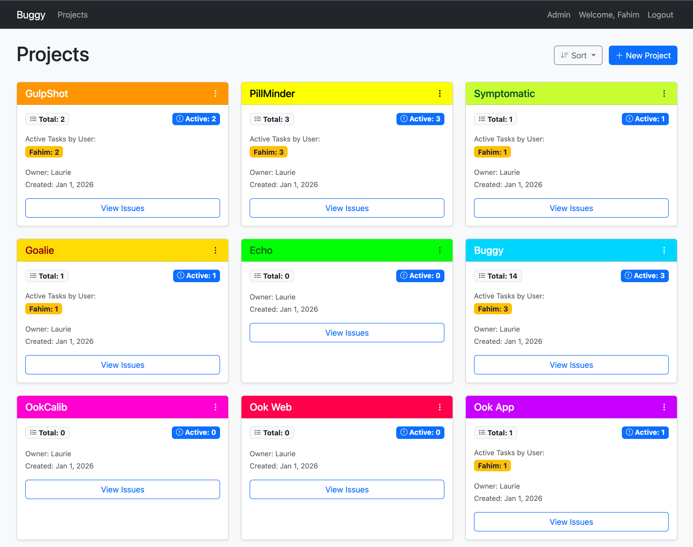
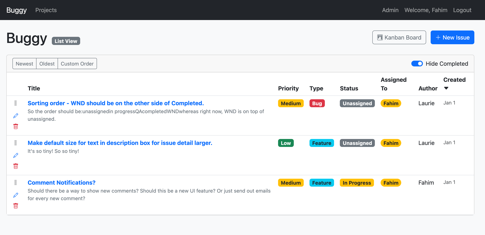
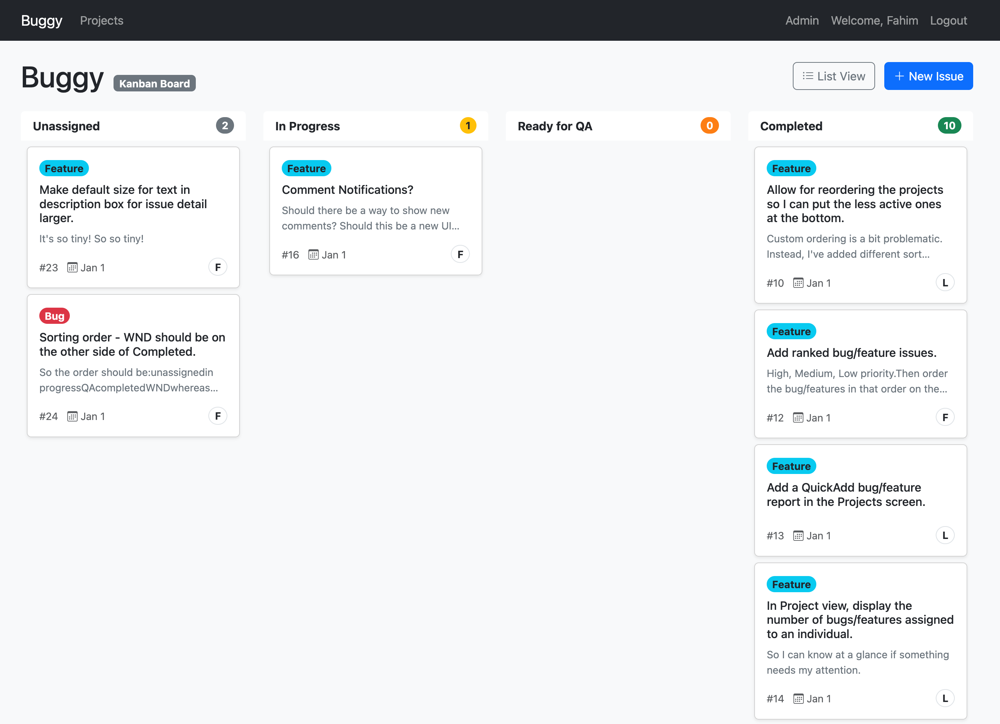

- # Buggy - Issue Tracker

    Buggy is a lightweight, multi-user, multi-project issue tracker built with native PHP and SQLite.

    After years of using various issue trackers, I found that most were either too feature-heavy, complicated to set up, or lacked an intuitive interface. Buggy was created to fill that gap — a simple, fast-to-deploy tracker with exactly the features I needed and a clean, straightforward UI.

     *Main Interface - Projects List*

     *Issues List*

     *Kanban View*

    ## Features

    - **Multi-Project Support**: Create and manage multiple projects with ease
    - **Kanban Board**: Drag-and-drop issues between status columns (Unassigned, In Progress, Ready for QA, Completed, WND — Will Not Do)
    - **Issue Management**: Create detailed issues with rich text descriptions and image attachments
    - **Collaboration**: Add comments and attachments to facilitate team discussions
    - **Custom Sorting**: Organize issues with drag-and-drop sorting in list view
    - **User Management**: Multi-user support with role-based access

    ## Requirements

    - PHP 8.0 or higher
    - PDO SQLite extension (typically enabled by default)

    ## Setup & Running

    ### Option 1: Built-in PHP Server

    Perfect for local development and testing.

    1. **Navigate to the project directory:**

        ```bash
        cd /path/to/buggy
        ```

    2. **Start the PHP built-in server:**

        ```bash
        php -S localhost:8000 -t public
        ```

    3. **Open your browser:** Go to http://localhost:8000

    4. **First Run:** You'll be redirected to a setup page to create your first Admin user.

    ### Option 2: Webserver (Apache/NGINX)

    For production deployments or shared hosting environments.

    #### Apache Setup

    1. **Copy files to your webserver:**

        ```bash
        # Copy the entire project to your web directory
        cp -r /path/to/buggy /var/www/html/buggy
        ```

    2. **Set proper permissions:**

        ```bash
        # Ensure the webserver can write to the database directory
        chown -R www-data:www-data /var/www/html/buggy
        chmod -R 755 /var/www/html/buggy
        # Make database directory writable
        chmod 775 /var/www/html/buggy/data
        ```

    3. **Configure Apache:** Create a virtual host configuration (e.g., `/etc/apache2/sites-available/buggy.conf`):

        ```apache
        <VirtualHost *:80>
            ServerName buggy.yourdomain.com
            DocumentRoot /var/www/html/buggy/public
            
            <Directory /var/www/html/buggy/public>
                Options Indexes FollowSymLinks
                AllowOverride All
                Require all granted
            </Directory>
            
            ErrorLog ${APACHE_LOG_DIR}/buggy-error.log
            CustomLog ${APACHE_LOG_DIR}/buggy-access.log combined
        </VirtualHost>
        ```

    4. **Enable the site and restart Apache:**

        ```bash
        sudo a2ensite buggy
        sudo systemctl restart apache2
        ```

    #### NGINX Setup

    1. **Copy files to your webserver:**

        ```bash
        # Copy the entire project to your web directory
        cp -r /path/to/buggy /var/www/buggy
        ```

    2. **Set proper permissions:**

        ```bash
        # Ensure the webserver can write to the database directory
        chown -R www-data:www-data /var/www/buggy
        chmod -R 755 /var/www/buggy
        # Make database directory writable
        chmod 775 /var/www/buggy/data
        ```

    3. **Configure NGINX:** Create a server block configuration (e.g., `/etc/nginx/sites-available/buggy`):

        ```nginx
        server {
            listen 80;
            server_name buggy.yourdomain.com;
            root /var/www/buggy/public;
            
            index index.php index.html;
            
            location / {
                try_files $uri $uri/ /index.php?$query_string;
            }
            
            location ~ \.php$ {
                include snippets/fastcgi-php.conf;
                fastcgi_pass unix:/var/run/php/php8.0-fpm.sock;
                fastcgi_param SCRIPT_FILENAME $document_root$fastcgi_script_name;
                include fastcgi_params;
            }
            
            location ~ /\.ht {
                deny all;
            }
        }
        ```

    4. **Enable the site and restart NGINX:**

        ```bash
        sudo ln -s /etc/nginx/sites-available/buggy /etc/nginx/sites-enabled/
        sudo nginx -t
        sudo systemctl restart nginx
        ```

    5. **Access Buggy:** Open your browser and navigate to your configured domain (e.g., `http://buggy.yourdomain.com`)

    6. **First Run:** You'll be redirected to a setup page to create your first Admin user.

    ## Security Notes

    - Ensure the `data` directory is writable by the webserver but not publicly accessible
    - Consider using HTTPS in production (use Let's Encrypt for free SSL certificates)
    - Regularly backup your SQLite database located in the `data` directory

    ## License

    (opensource.org)

    This project is licensed under the terms of the [MIT license](LICENSE).

    ## Support

    For issues, questions, or contributions, please [open an issue](https://github.com/yourusername/buggy/issues) on GitHub.
